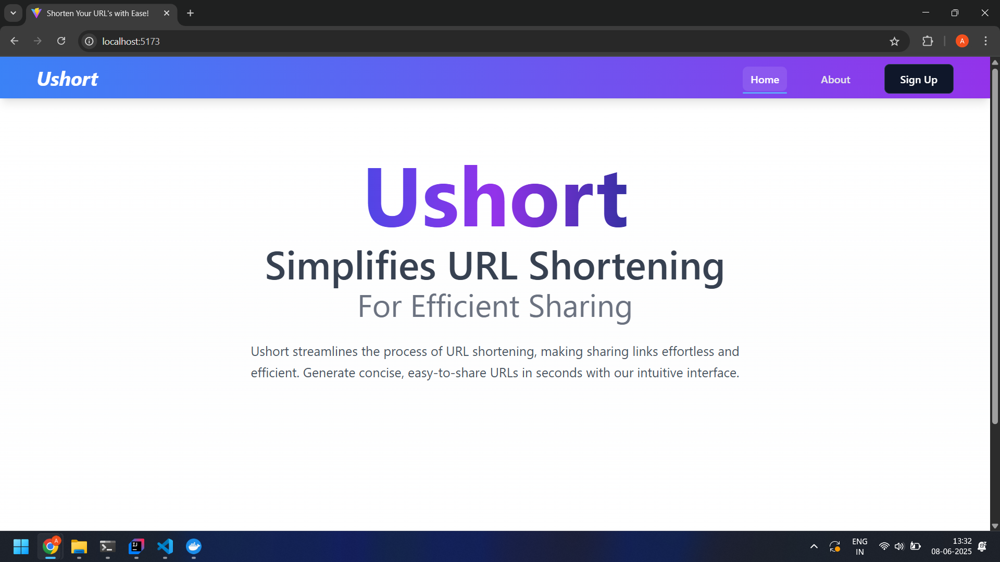
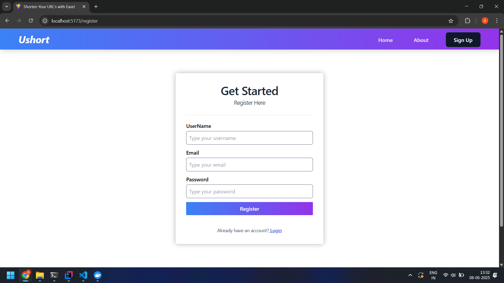
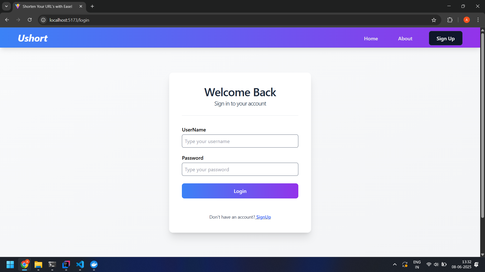
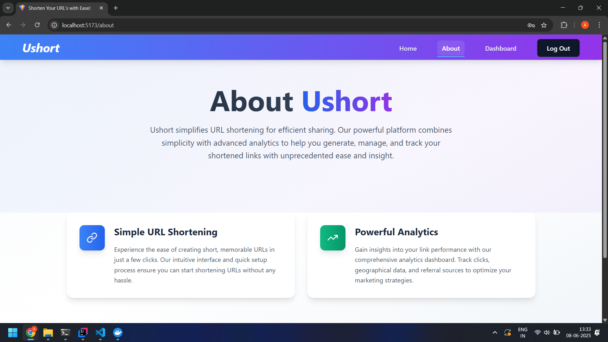
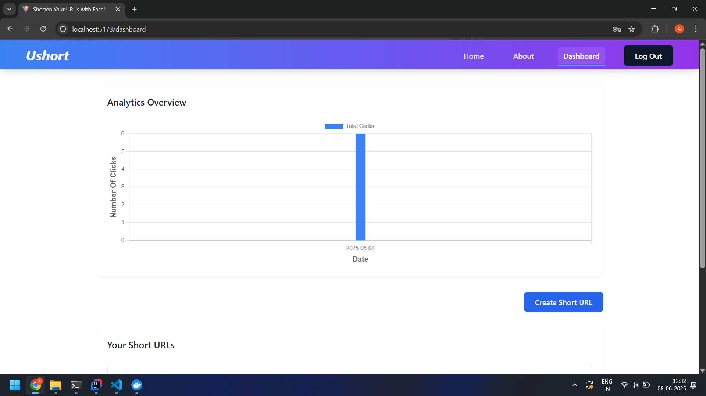
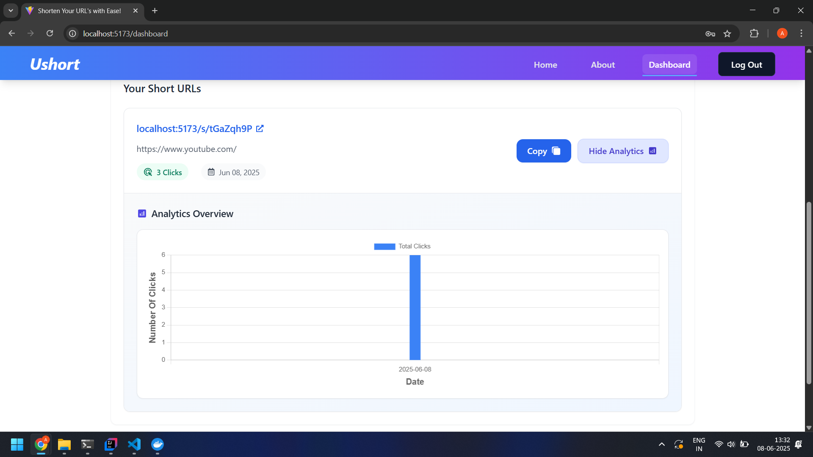

# 🔗 URL Shortener App

A full-stack URL Shortener web application built with Spring Boot and React. Instantly shorten long URLs into compact, shareable links that redirect to the original address.

---

## 📸 Preview

---

## 🛠️ Tech Stack

### Backend
- Spring Boot
- Spring Web, Spring Data JPA
- MySQL
- Lombok

### Frontend
- React.js (Vite)

## ✨ Features

- ✅ Shorten long URLs
- ✅ Redirect short URLs to original
- ✅ Analysis
- ✅ User login/signup with email
- ✅ Show registered user’s shortened URLs *(optional)*

---

## ⚙️ How It Works

1. User enters a long URL.
2. Frontend sends a POST request to the Spring Boot backend.
3. Backend generates a short code (e.g., `abc123`).
4. Stores mapping of short code ↔ original URL in the DB.
5. User receives a short URL like `https://yourdomain.com/abc123`.

